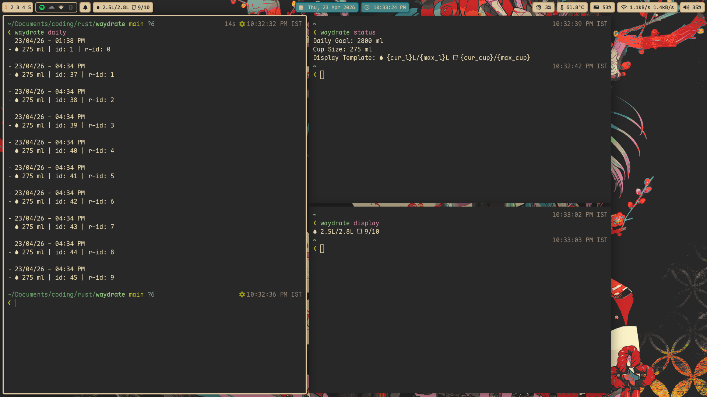

# Waydrate
A simple program that helps you stay hydrated.

Waydrate is designed to be simple in concept. It only needs two core pieces of information:
1. The volume of your cup in milliliters (ml).
2. Your daily goal in milliliters (ml).

Based on your cup's volume, it displays how many cups you need for the day. This is deliberately all.
## Screenshots


## Installation
[To be written.]

## Waybar (and similar integration)
The binary has this command, `waydrate display watch`, which can be used to
integrate this program as a convenient module for your waybar (or something equivalent with support for listening for changes to stdout.)

```json
"custom/hydration": {
    "format": "{}", 
    "exec": "waydrate display watch",
    "return-type": "",
    "tooltip": true,
    "restart-interval": 5
},
```

## Keyboard Shortcuts
This binary doesn't have the concept of keyboard shortcuts, but it is easy to
integrate it with your window manager. This is because the database is stored in a persistent place, so you don't have to deal with anything other than putting the program onto your `$PATH`.

To record you had a cup, simply run `waydrate record cup`. You can even give it a count, `waydrate record cup 3`.

There is also `waydrate record remove last` which is solely there to help you
set it up with a keyboard shortcut and revert your last mistake in the logs (when
you eventually make one.)

### Niri Example
```kdl
Mod+Ctrl+Semicolon {spawn "waydrate" "record" "cup";}
Mod+Ctrl+bracketLeft {spawn "waydrate" "record" "remove" "last";}
```

## Daily Logs
With `waydrate daily`, you can see your progress for the day.

## Removing Logs
`waydrate record remove` supports two modes, relative IDs and absolute IDs. By default, it expects relative IDs (`r-id` in `daily` command). You can use `-r` flag of `remove` to use absolute IDs instead.

Relative IDs start from 0 per day.

## Configuring Things
Please see `waydrate set --help`. Especially `waydrate set display-template --help`.

## Command-line Interface
```console
❮ waydrate --help
Usage: waydrate [OPTIONS] <COMMAND>

Commands:
  daily    Daily intake log
  setup    Setup Waydrate
  set      Configure things
  record   Record intakes
  status   See Waydrate's status
  display  Print the templated hydration status (-j for JSON output)
  help     Print this message or the help of the given subcommand(s)

Options:
      --db-url <DB_URL>
  -d, --debug
  -h, --help             Print help
```
